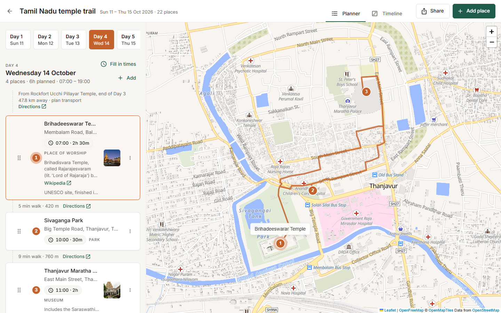
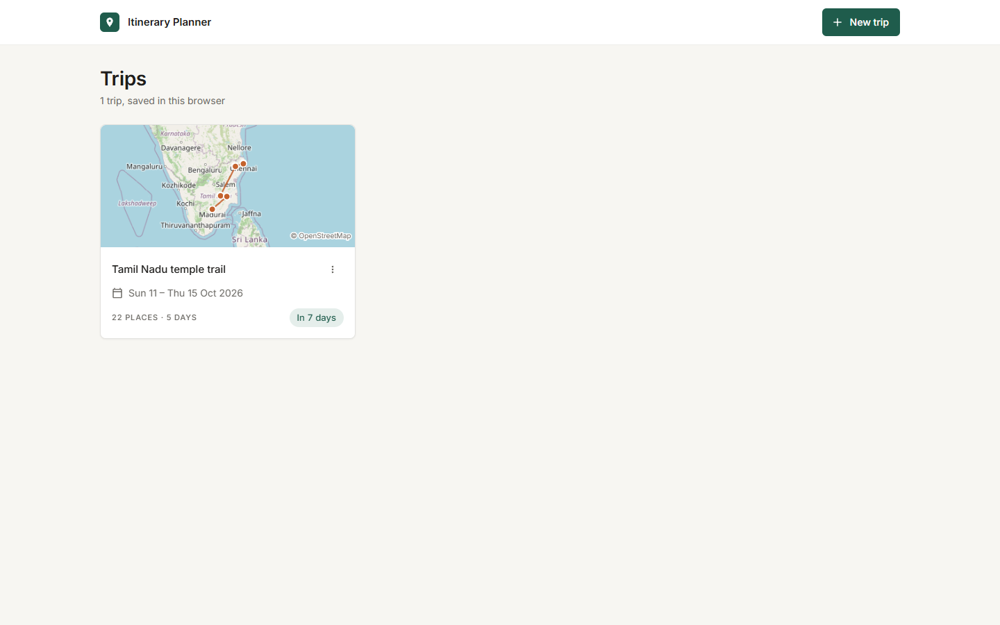
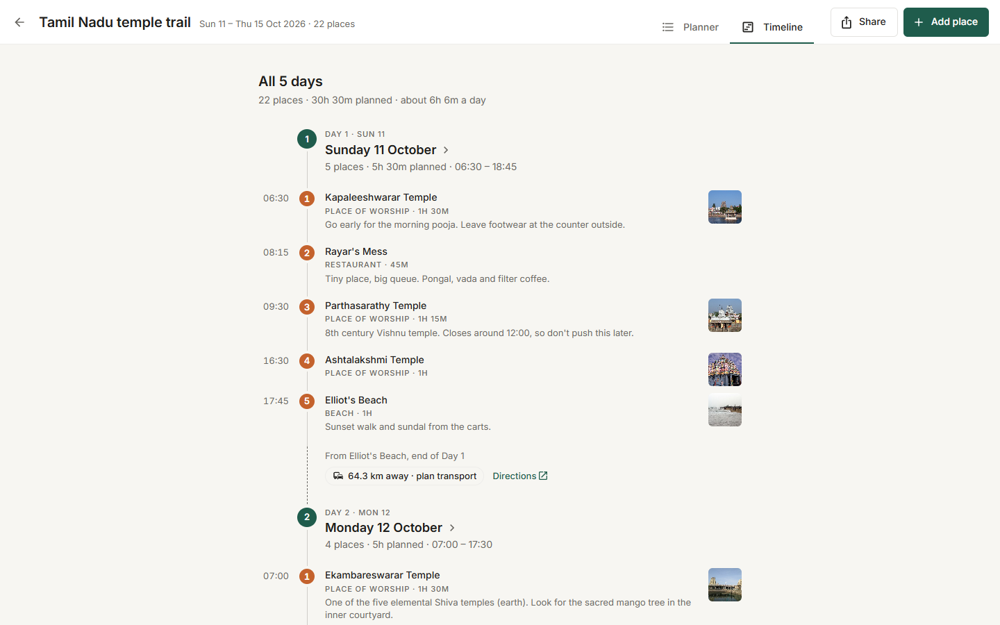
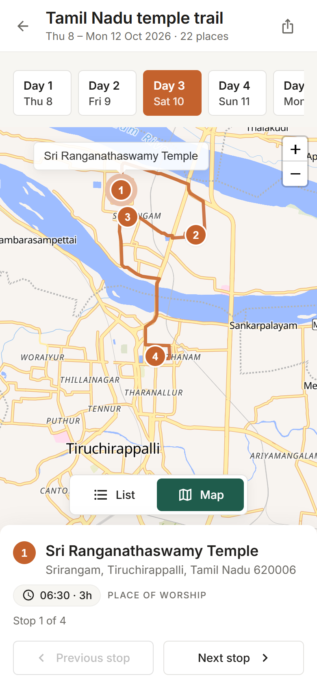

# Trip Itinerary Planner

Plan a multi-day trip one day at a time: search for places, drop them onto days,
drag them into order, and see each day's walking route on a map. Trips are saved
in the browser and can be shared as a read-only link, with no account and no
server.

**Live:** https://deluxe-lokum-7cb537.netlify.app



| Trips | Timeline | Phone |
|---|---|---|
|  |  |  |

## What it does

- **Trips.** Create, rename, re-date, duplicate and delete trips. Each card shows
  the route on a small map and where the trip stands: "In 7 days", "Day 2 of 5"
  or "Past". Changing the dates keeps each day's places, and warns before a
  shorter range would drop any.
- **Place search.** Search OpenStreetMap by name, biased towards the area the day
  already covers, and add a result to the open day. Before typing, quick ideas
  (Temples, Food, Cafés, Museums, Parks, Hotels) find places within walking
  distance of the day's stops.
- **Photos and descriptions.** Places with a Wikipedia article show its photo on
  their card, the map's stop card and the timeline. Selecting a card shows the
  article's opening lines and a link to the rest.
- **Itinerary.** Each place gets an optional time, duration and note. A day shows
  its planned hours, its span and the walk between stops. Each day also opens with
  how far it starts from the previous day's last stop: a walk when it's close, or
  the distance and "plan transport" when the trip changes town.
- **Planning help.** "Fill in times" schedules a day from a start time, using
  each stop's duration and the walk to the next. A stop that starts before the
  previous one finishes, or doesn't leave time for the walk, gets a warning.
- **Directions.** Every walk between stops, and every "plan transport" gap
  between days, has a Directions link that opens Google Maps. Each place's menu
  can open it there too.
- **Drag and drop.** Reorder within a day, or drop a card on another day's tile
  to move it there. With a mouse, drag by the handle; on a phone, long-press
  anywhere on the card and it lifts with a short buzz. The keyboard works too,
  and every card's menu can move it up, down or to another day without dragging.
- **Map.** Numbered stops and the walking route for the open day. Selecting a stop
  in the list or on the map selects it in both.
- **Timeline.** The whole trip on one line down the page: each day, its stops at
  their times, and the distance from one day to the next. Days over seven hours
  are flagged.
- **Progress.** Tick a stop off as visited from the planner or by clicking its
  number on the timeline. The timeline also follows the clock: past days show as
  completed, today is marked, stops whose time has gone by fade back, and a "Now"
  marker sits on the line.
- **Sharing.** A link that carries the whole trip. The person who opens it sees a
  read-only copy and can save it to their own browser.

Try **Try a sample trip** on an empty trips page for a five-day Tamil Nadu
temple trail.

## Running it

Needs Node 18 or later.

```bash
npm install
npm run dev
```

| Script | Does |
|---|---|
| `npm run dev` | Dev server at http://localhost:5000 (`PORT` in `.env` changes it) |
| `npm run build` | Production build into `dist/` |
| `npm run preview` | Serves the production build, also on port 5000 |
| `npm run typecheck` | TypeScript, strict |
| `npm run lint` | ESLint, zero warnings allowed |
| `npm test` | Vitest |
| `npm run format` | Prettier over `src/` |

No configuration is needed. `.env.example` lists optional overrides: the dev
server port, the search and routing servers, the map style and the fallback tiles. The `VITE_` ones are read at build time and end up in the
client bundle, so nothing secret belongs there.

Deployed on Netlify from `main`. `netlify.toml` holds the build command and the
single-page-app fallback that makes deep links survive a refresh.

## Stack, and why each piece is there

| Package | Why |
|---|---|
| React 18, TypeScript, Vite | The brief's fixed stack. TypeScript is strict with `noUncheckedIndexedAccess`. |
| React Router 6 | Pages, plus the URL holding the open day, the selected place and the open panel. |
| MUI 5 | Accessible primitives: dialogs, menus, tabs, snackbars, inputs. |
| styled-components 6 | All custom styling. MUI keeps its own Emotion engine. |
| react-dnd + HTML5 and Touch backends | Drag and drop that keeps the drag state in components until the drop. |
| Leaflet + react-leaflet | The map: markers, the route, controls and the camera. Free, no API key. |
| maplibre-gl + @maplibre/maplibre-gl-leaflet | Draws the vector base map underneath Leaflet. The standard raster tiles were too busy, and every clean raster style now needs an API key. |
| date-fns | Date ranges and formatting without timezone surprises. |
| fflate | Compresses share links. Small, and has a synchronous API. |
| @fontsource-variable/inter | Self-hosted font, so there is no request to a font CDN. |

The external services all run on OpenStreetMap data: **OpenFreeMap** vector tiles
for the map, **Nominatim** for search and the **FOSSGIS OSRM** server's walking
profile for routes, plus **Wikipedia** for place photos and descriptions. They are
free and run on donated infrastructure, so each one has a defined failure path
instead of an assumption that it is up.

Photos come from the Wikipedia article OpenStreetMap links to each place, saved
with the place when it's added. A whole day or trip is fetched in a single
request, so the app stays well inside Wikipedia's rate limits. If Wikipedia is
down, the cards simply show no photo.

## Architecture

```
src/
  components/   common UI (Button, Dialog, Sheet, Tabs, …), feedback, layout
  constants/    every number, URL and string the UI uses
  context/      trip state: actions, reducer, provider, persistence
  features/     trips, places, itinerary, map, timeline, share
  hooks/        app-wide hooks
  routes/       one folder per page
  services/     storage, http, nominatim, osrm, wikipedia (the only code that does I/O)
  theme/        colours, type, spacing, radii, shadows, motion, global styles
  mocks/        the sample trip
```

Features own their components, hooks and utils. Pages compose features. Only
`components/` and `theme/` may import MUI or Emotion, which ESLint enforces.

### State lives in three places

| Tier | Holds | Where |
|---|---|---|
| Persistent | Trips, days, places | A reducer in `TripContext`, mirrored to localStorage |
| Session | Open day, selected place, search panel, phone view | URL search params |
| Ephemeral | Drag in progress, search text, hover target | Component state |

Keeping selection in the URL is the decision that pays most. Every view survives a
refresh and the back button, and there is no second copy of "which day is open" to
fall out of sync.

The reducer handles eight actions named for what the user did (`ADD_PLACE`,
`MOVE_PLACE`, `UPDATE_TRIP`, …). Action creators take the timestamp as an
argument, so the reducer stays pure and easy to test. Writes to localStorage are
debounced and flushed on `pagehide`. The stored data carries a schema version, and
unreadable data is reported to the user rather than silently wiped.

Redux was left out on purpose. Every change is a small edit to one trip, with no
server cache, cross-tab sync or time travel to manage, and a reducer already
covers that.

### Drag and drop

While a card is dragged, the new order lives in the list component. The reducer
hears about it once, on drop. Committing on every hover would re-render the map
dozens of times a second. The backend is picked once at startup: HTML5 for
pointers, Touch (with a short hold, so scrolling still works) for touch screens.

The keyboard path uses the same reducer action. With a card focused, **Ctrl+↑/↓**
moves it within the day and **Ctrl+←/→** moves it to the previous or next day.
Every move is announced through a live region.

### Map

- The base map is OpenFreeMap's Liberty style, drawn by MapLibre as a layer under
  Leaflet. Labels stay sharp at every zoom, and markers and the route are still
  plain Leaflet. Browsers without WebGL get the standard OpenStreetMap raster
  tiles instead.
- The map is memoised, so typing a note doesn't redraw it.
- Markers are keyed by place id, so a reorder renumbers them instead of rebuilding them.
- The view fits the day's stops when the day changes, never on every edit, so
  adding a place doesn't move the map out from under you.
- The routing server starts each leg on the nearest walkable road, so a stop inside
  a temple compound or a park gets a short spur from the road to its pin.
- Routes are fetched only when the ordered list of coordinates changes. Requests
  are debounced, cached by that list, and aborted when superseded.
- If routing fails, the stops are joined with a dashed straight line and a quiet
  notice offers a retry.

### Sharing

```
/s#v1.<base64url(deflate(JSON))>
```

The trip goes in the URL fragment because browsers never send the fragment to a
server. That is what makes "nothing about your trip leaves your browser" true for
shared trips as well. The Google Maps links are ordinary links: nothing is sent
to Google unless the user clicks one, and then only those two points. A five-day, 22-place trip comes to about 2,700 characters.
Past 4,000 the share dialog warns that some apps may cut the link short. Links that
are truncated, damaged or from another format version show an error page, never a
blank screen.

### Styling

One token object (`theme/tokens.ts`) feeds both the MUI theme and the
styled-components theme. ESLint rejects hex colours and pixel values outside
`theme/`, and the `sx` prop outside `components/`. Pages are built only from the
shared components, so a colour or spacing change is made in exactly one place.

### Failure handling

- `http.ts` is the only place that calls `fetch`. Every request has a timeout, and
  failures come back as one of four kinds: offline, rate-limited, timed out or
  failed. Each kind maps to its own message.
- Error boundaries wrap the map, the search panel and each page separately. A
  broken tile layer leaves the itinerary usable.
- Search results are cached per query and debounced at 500 ms, to stay inside
  Nominatim's usage policy.

### Motion and performance

- Motion only explains change:
  - cards fade up as they appear
  - neighbours glide out of the way during a reorder
  - new markers drop onto the map
  - the map eases between days

  It uses transforms and opacity only, and all of it switches off when the OS asks
  for reduced motion.
- The planner and the map are split out of the first download:

  | Download | Size (gzipped) | When it loads |
  |---|---|---|
  | App | about 194 KB | First visit |
  | Planner and drag and drop | 25 KB | When a trip is opened |
  | Map, including MapLibre | about 268 KB | When the map is first shown |

  The map chunk takes the total past the original 400 KB budget. That was a
  deliberate trade for a readable map, and the first screen still downloads
  under 200 KB.

### Accessibility

- Every drag has a keyboard equivalent.
- Every interactive element has a visible focus ring.
- Colour is never the only signal. Busy days also get a text chip, and a
  fallback route is drawn dashed, with a notice.
- Layouts are checked from 360 px wide:
  - **Phone:** list and map switch with a toggle.
  - **600 to 900 px:** the list sits above a fixed-height map.
  - **Wider:** both side by side.

## Testing

Vitest with Testing Library, aimed at logic that breaks quietly:

- every reducer action, especially moving places across days
- storage reads of corrupt and old-version data
- share link round trips, including truncated and wrong-version input
- route fetching and cancellation, and joining stops that sit off the road
- day progress: what counts as over, complete, and where "now" sits
- trips saved before the visited flag existed still loading
- walking versus "plan transport" between days
- filling in a day's times, spotting clashes, and building the Google Maps links
- Wikipedia lookups: following redirects, skipping missing articles, batching
- trip card status, duplicating a trip, and fitting map tiles to a card
- a keyboard reorder through the real itinerary panel

Appearance isn't tested, and there are no snapshot tests. A snapshot mostly
records that markup changed, not whether it is right.

## Deliberately left out

Each of these is a decision, not an oversight.

| Not included | Why |
|---|---|
| Accounts and a backend | The brief asks for zero running cost. localStorage plus share links cover single-user planning without storing anyone's data. |
| Real-time collaboration | Needs a server and conflict handling. A share link covers "show my plan to someone". |
| Sync across devices | Same reason. Sharing a link to yourself and saving a copy works today. |
| Transport modes | One honest mode, walking, beats driving and transit times from free servers with no traffic or timetable data. Between towns, a Directions link hands off to Google Maps instead. |
| Opening hours, prices, bookings | Data that is wrong more often than not, from sources without a free API. |
| Offline mode and a service worker | Saved trips already work offline. Offline maps would mean bulk-downloading map tiles, which the free tile services don't allow. |
| A state library | See "State lives in three places". The reducer is the whole job. |
| List virtualisation | Days hold tens of places, not thousands. |
| Server rendering | Everything is per-user and behind localStorage, so there is nothing to pre-render. |
| A map-provider abstraction | Swapping providers touches one service file and one component. Building the abstraction before a second provider exists would be guesswork. |
| Printing and PDF export | The timeline page covers reading a whole trip at a glance. |

## Known limits

- Trips live in one browser. Clearing site data deletes them, and a share link is
  the way to move one. Visited ticks travel with it.
- Distances between days are straight-line. Real road distances are a little
  longer, and the app doesn't plan the transport itself.
- Search and routing use public servers shared by everyone. Heavy use can hit
  their rate limits, and the app tells the user when it does.
- Very long trips produce long links. The share dialog warns past 4,000
  characters.
- Photos only appear for places OpenStreetMap links to an English Wikipedia
  article. Small restaurants and places saved before photos existed have none.

## Credits

Map data © [OpenStreetMap](https://www.openstreetmap.org/copyright) contributors,
tiles by [OpenFreeMap](https://openfreemap.org) using the
[OpenMapTiles](https://www.openmaptiles.org/) schema.
Search by [Nominatim](https://nominatim.org/), walking routes by the
[FOSSGIS OSRM](https://routing.openstreetmap.de/) server. Place descriptions from
[Wikipedia](https://en.wikipedia.org/) (CC BY-SA), photos from Wikimedia Commons.
